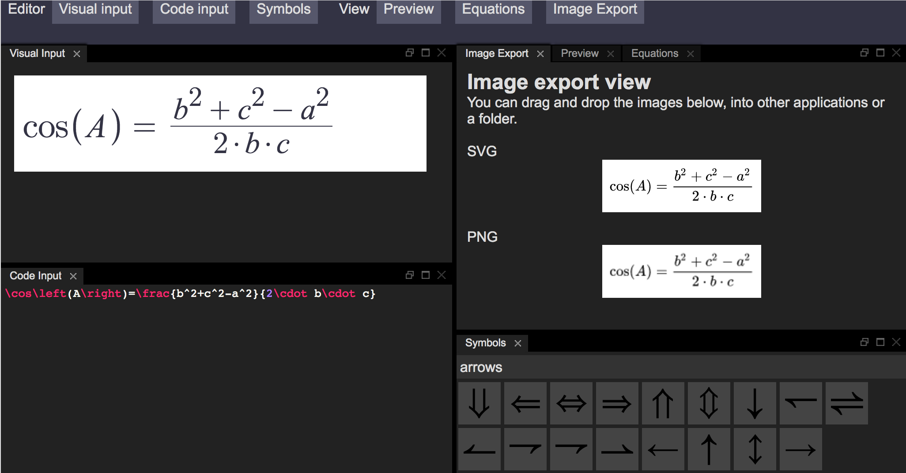

# LaTeX Equation Toolbox
> LaTeX Equation Toolbox is a website that can be used to write, solve, render and export LaTeX Math

[Link to website](https://viktorstrate.github.io/latex-equation-toolbox/)

### Features

- Graphical equation editor
- Code LaTeX editor
- Automatically export to PNG and SVG images
- Catalogue of symbols that can easily be added
- Simplify expressions
- Solve equations